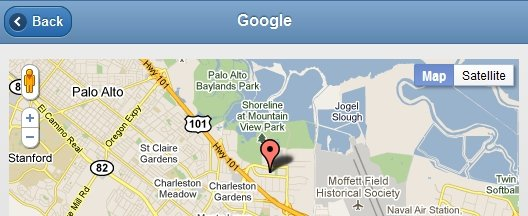

Using ASP.NET MVC I created a mashup with jQuery Mobile and Google Maps. This app reads a list of locations from an xml file and creates a jQuery Mobile page for each location. Each page contains a map with a marker and an info window for displaying the location details.

<!--more-->


## About jQuery Mobile

With jQuery Mobile you can create a website that has the look and feel of a native mobile app. My favorite feature of the jQuery Mobile framework is the ajax-driven page navigation. After navigating through a few pages on a jQuery Mobile website view the page's generated source and you will see that all subsequent pages have been injected to the homepage's DOM and the navigation is based on hash values. This allows for smooth transitions between pages that have already been loaded. Read more about jQuery Mobile here: [http://jquerymobile.com/](http://jquerymobile.com/)

## How my app works

My ASP.NET MVC 3 project uses jQuery Mobile 1.0 Alpha 3 and Google Maps API 3. My data source is an XML file which contains a list of 10 Information Technology companies in Silicon Valley. A page is generated for each company and their headquarters are displayed on a map. There were a couple of gotchas I came across when implementing Google Maps with jQuery Mobile which I will discuss later on in the post.

## Model

First, I created a _Location.cs_ class based on the structure of my _Locations.xml_ file.


``` xml
<?xml version="1.0" encoding="utf-8" ?>
<locations>

  <location>
    <id>1</id>
    <name>Google</name>
    <address>1600 Amphitheatre Parkway</address>
    <city>Mountain View</city>
    <state>CA</state>
    <zip>94043</zip>
  </location>

  <location>
    <id>2</id>
    <name>Apple</name>...
```


``` c#
public class Location
{
    public Location(int id, string name, string address, string city, string state, string zip)
    {
        this.ID = id;
        this.Name = name;
        this.Address = address;
        this.City = city;
        this.State = state;
        this.Zip = zip;
    }

    public int ID { get; set; }
    public string Name { get; set; }
    public string Address { get; set; }
    public string City { get; set; }
    public string State { get; set; }
    public string Zip { get; set; }
    public double Lat { get; set; }
    public double Lng { get; set; }
}
```


I also created a _LocationModel.cs_ class which uses LINQ to read the XML file and append each Location to a List of Location objects.


``` c#
public LocationModel()
{
    // Linq to read XML data and create a List of Location objects
    XDocument locationMetaData = XDocument.Load(HttpContext.Current.Server.MapPath("~/App_Data/Locations.xml"));
    var locations = from location in locationMetaData.Descendants("location")
                    select new Location((int)location.Element("id"), location.Element("name").Value,
                    location.Element("address").Value, location.Element("city").Value,
                    location.Element("state").Value, location.Element("zip").Value);
    this.AddRange(locations.ToList<Location>());
}
```


## Controller

I have one Controller named _HomeController.cs_ which creates an instance of LocationModel at the class level and returns all locations to the Index View. It also looks up specific locations for the Map View based on the unique ID passed in the url to the Map method.


``` c#
LocationModel allLocs = new LocationModel();

public ActionResult Index()
{
    return View(allLocs);
}

public ActionResult Map(int id)
{
    Location loc = this.getLocation(id);

    // if the id does not match any location return error page
    if (loc == null)
    {
        return View("Error");
    }
    else
    {
        if (this.lookupGeoCode(loc))
        {
            return View(loc);
        }

        else
        {
            return View("Error");
        }
    }
}

// returns the Location object that matches the id parameter
private Location getLocation(int id)
{
    Location result = allLocs.Find(item => item.ID == id);
    return result;
}
```


I am using Google's GeoCoding API to look up the Lat and Long for an address so it can be plotted on the map. I am requesting the results in an xml format and parsing them using LINQ. If the lookupGeoCode() method fails at getting the Lat and Long it returns false and the Map method returns the Error View.


``` c#
// uses Google GeoCoding API to lookup Lat and Long for an address (http://code.google.com/apis/maps/documentation/geocoding/)
private Boolean lookupGeoCode(Location loc)
{
    string PostUrl = "http://maps.googleapis.com/maps/api/geocode/xml?address=" + loc.Address + "," + loc.City + "," + loc.State + "&sensor=false";

    XDocument geo = XDocument.Load(PostUrl);

    // if an error occurs with the GeoCoding API return false
    try
    {
        loc.Lat = (double)(from geocode in geo.Descendants("location")
                           select geocode.Element("lat")).SingleOrDefault();

        loc.Lng = (double)(from geocode in geo.Descendants("location")
                           select geocode.Element("lng")).SingleOrDefault();

        return true;
    }
    catch
    {
        return false;
    }
}
```


## View

I am using the new Razor view engine which is available with ASP.NET MVC 3. I have two Views, Index and Map, which are both strongly-typed. The <em>_Layout.cshtml</em> is my master page and in order to get Google Maps working with jQuery Mobile I had to put the JavaScript reference to the Google Maps API here along with the css style for the map.

*_Layout.cshtml*
``` html
<!DOCTYPE html>
<html>
<head>
    <!--Developed by Greg Jopa on 2/5/2011 - http://www.gregjopa.com/2011/02/asp-net-mvc-3-with-jquery-mobile-and-google-maps/ -->
    <title>@ViewBag.Title</title>
    <link rel="stylesheet" href="http://code.jquery.com/mobile/1.0a3/jquery.mobile-1.0a3.min.css" />
    <script src="http://code.jquery.com/jquery-1.5.min.js"></script>
    <script src="http://maps.google.com/maps/api/js?sensor=false"></script>
    <script src="http://code.jquery.com/mobile/1.0a3/jquery.mobile-1.0a3.min.js"></script>
    <style type="text/css">
        body { background: #dddddd;}
    .gmap { height: 330px; width: 100%; margin: 0px; padding: 0px }
  </style>
</head>
<body>
    @RenderBody()
</body>
</html>
```


My Index View returns a hyperlink for each location.

_Index.cshtml_


``` html
@using jQueryMobileMVC3.Helpers

@model IEnumerable<jQueryMobileMVC3.Models.Location>

@{
    ViewBag.Title = "jQuery Mobile w/ Google Maps";
}
<div data-role="page" class="page-home">

    <div data-role="header" data-theme="b">
        <h1>Silicon Valley</h1>
    </div>

    <div data-role="content">

        <ul data-role="listview" data-inset="true">
            @foreach (var item in Model)
            {
                <li>@Html.ActionLink((string)item.Name, "Map", "Home", new { id = item.ID }, null).AutoRemoveAlias()</li>
            }
        </ul>

    </div>
</div>
```


I am using Html.ActionLink to generate my hyperlinks and talk to my controller. When publishing this ASP.NET MVC Project to my GoDaddy shared hosting I ran into a problem with my hyperlinks including the directory path aliased to my subdomain name which made the url long and ugly. The relative url returned by Html.ActionLink was including /gregjopa/code/ which is aliased to code.gregjopa.com. So my url originally looked like:

```
http://code.gregjopa.com/gregjopa/code/mvc/jquerymobile/gmaps/#Home/Map/1
```

instead of:

```
http://code.gregjopa.com/mvc/jquerymobile/gmaps/#Home/Map/1
```

I originally tried to fix this by using the URL Rewrite Module available in IIS 7 but I couldn't get this working with my GoDaddy hosting. So instead I created a helper method to remove the unwanted portion of the url generated by the Html.ActionLink method.


``` c#
/* Helper methods to remove the aliased directory added to the url for each hyperlink
     * Code adapted from the following stackoverflow.com post: http://stackoverflow.com/questions/604814/asp-net-mvc-actionlinks-and-shared-hosting-aliased-domains
     */
    public static class ActionLinkHelper
    {
        public static string RemoveAlias(this MvcHtmlString link, string alias)
        {
            // Find the href param and replace ...
            return link.ToHtmlString().Replace((alias+"/"), "");
        }

        public static MvcHtmlString AutoRemoveAlias(this MvcHtmlString link)
        {
            var appRoot = HttpContext.Current.Request.ApplicationPath;
            return appRoot != "/" ? MvcHtmlString.Create(link.RemoveAlias(appRoot)) : MvcHtmlString.Create(link.ToHtmlString());
        }
    }
```


The Map View includes the JavaScript for Google Maps. You cannot use document.ready() when using jQuery Mobile. Instead you must use specific jQuery Mobile page events to inject code into the DOM. My app uses the pagecreate, pageshow, and pagehide events to execute JavaScript. I had to add an id to each page so it could be uniquely referenced in the jQuery Mobile events. Also, in order to have a separate map on each page I had to use unique JavaScript variable names when defining each map.

_Map.cshtml_


``` html
<div data-role="page" id="page-map@(Model.ID.ToString())">

  <div data-role="header" data-theme="b">
        <h1>@Model.Name</h1>
  </div>

  <div data-role="content">

    <div id="map@(Model.ID.ToString())" class="gmap"></div>

    <script type="text/javascript">
      var map@(Model.ID.ToString()), latlng@(Model.ID.ToString()), options@(Model.ID.ToString()), infowindow@(Model.ID.ToString()), marker@(Model.ID.ToString()), contentString@(Model.ID.ToString());
      function initialize() {

          latlng@(Model.ID.ToString()) = new google.maps.LatLng(@(Model.Lat), @(Model.Lng));
          options@(Model.ID.ToString()) = { zoom: 12, center: latlng@(Model.ID.ToString()), mapTypeId: google.maps.MapTypeId.ROADMAP };
          map@(Model.ID.ToString()) = new google.maps.Map(document.getElementById("map@(Model.ID.ToString())"), options@(Model.ID.ToString()));

      }
      $('#page-map@(Model.ID.ToString())').live('pagecreate', function () {

          //console.log("pagecreate");
            initialize();
      });

      $('#page-map@(Model.ID.ToString())').live('pageshow', function () {

          //console.log("pageshow");
            google.maps.event.trigger(map@(Model.ID.ToString()), 'resize');
          map@(Model.ID.ToString()).setOptions(options@(Model.ID.ToString()));

             contentString@(Model.ID.ToString()) = '<div>'+
                '<p><b>@(Model.Name.ToString())</b><br />@(Model.Address.ToString())<br />' +
                '@(Model.City.ToString()), @(Model.State.ToString()) @(Model.Zip.ToString())</p>'+
                '</div>';

            infowindow@(Model.ID.ToString()) = new google.maps.InfoWindow({
                content: contentString@(Model.ID.ToString())
            });

            marker@(Model.ID.ToString()) = new google.maps.Marker({
                position: latlng@(Model.ID.ToString()),
                map: map@(Model.ID.ToString())
            });

            google.maps.event.addListener(marker@(Model.ID.ToString()), 'click', function() {
                infowindow@(Model.ID.ToString()).open(map@(Model.ID.ToString()), marker@(Model.ID.ToString()));
            });

            infowindow@(Model.ID.ToString()).open(map@(Model.ID.ToString()), marker@(Model.ID.ToString()));
      });

        $('#page-map@(Model.ID.ToString())').live('pagehide', function () {

            //console.log("pagehide");
            infowindow@(Model.ID.ToString()).close();
      });

    </script>

  </div>
</div>
```


## Conclusion

jQuery Mobile rocks! It is easy to develop with and the themes look great. It also provides a standardized user interface across all popular mobile device platforms. So instead of developing a mobile site with custom code for the iPhone, custom code for Android, custom code for the Windows phone, etc... you can just have one mobile site for all platforms.
