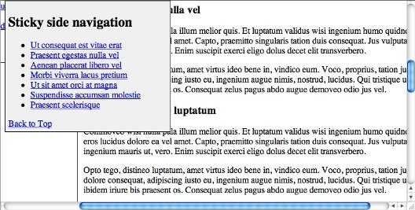

import DemoButtonGroup from "../../../src/components/DemoButtonGroup";


Many websites use CSS fixed positioning to pin elements to the top or bottom of a webpage so they never scroll out of view. This technique is commonly used for navigation elements on sites that require the user to scroll through many screenfuls of information on a single page.

I put together a demo that conditionally applies fixed positioning to a side navigation element when it scrolls to the top of the browser window.

<DemoButtonGroup
  downloadLink="http://gregjopa.me/code/javascript/fixed_positioning/jquery_conditional_fixed_positioning.zip"
  demoLink="http://gregjopa.me/code/javascript/fixed_positioning/"
/>

## How it works

This demo adds/removes _position:fixed_ styling to/from the side navigation based on the current vertical position of the window's scroll bar. It also attempts to solve some of the problems with using conditional fixed positioning in the real world.

Ben Nadel has an awesome post about using conditional fixed positioning that was a great starting point for me: [https://www.bennadel.com/blog/1810-Creating-A-Sometimes-Fixed-Position-Element-With-jQuery.htm](https://www.bennadel.com/blog/1810-Creating-A-Sometimes-Fixed-Position-Element-With-jQuery.htm). I used the javascript in Ben's first example as a starting point for my demo and made a few updates to it. I created this post to point out a few of the gotchas that come along with using this technique.

## Binding code to the window scroll event

This technique requires executing code every time the user scrolls the page. It is generally a bad idea to attach code directly to the window scroll event since it can fire a lot in a short period of time. John Resig describes this problem and a couple work arounds in his blog post "Learning from Twitter": [https://johnresig.com/blog/learning-from-twitter/](https://johnresig.com/blog/learning-from-twitter/)

Luckily "Cowboy" Ben Alman has an easy to use jQuery plugin that solves this problem by throttling the scroll event. You can read about and download Ben's plugin here: [http://benalman.com/projects/jquery-throttle-debounce-plugin/"](http://benalman.com/projects/jquery-throttle-debounce-plugin/). With this plugin you can specify how much to delay the execution of your code that's attached to the scroll event:

```javascript
// using Cowboy's jQuery throttle/debounce plugin
view.bind("scroll resize", $.throttle(100, stickyNavCheck));
```

## Horizontal Scrolling

If your browser window is smaller than the width of the website a horizontal scrollbar will appear. This horizontal scrollbar will cause your fixed position element to float over and hide other content on the page. Here is a screenshot of this problem:



To fix this issue with the horizontal scrollbar you need to check and see if the user has horizontally scrolled the page and if so update the _left_ css property of the fixed element. Here is the code I used to keep the fixed side navigation aligned:

```javascript
// called on window scroll event and on window resize event
function horizontalScrollCheck() {
  // update when horizontal scrollbar exists and is scrolled
  if (view.scrollLeft() > 0) {
    sidenav.css("left", -1 * view.scrollLeft() + 8);
  } else if (sidenav.css("left") != sidenavWrapperOffset.left) {
    sidenav.css("left", sidenavWrapperOffset.left);
  }
}
```

## IE6 and Quirks doctype

Fixed positioning is not available in IE6 or in any version of IE if you're stuck using the quirks mode doctype. There is a work around that involves wrapping all of your elements in a div except for the fixed positioned element and applying absolute positioning to it to make it appear fixed. You can read about this IE6 fixed positioning hack here: [http://www.howtocreate.co.uk/fixedPosition.html](http://www.howtocreate.co.uk/fixedPosition.html)

However, this IE fixed positioning hack has a couple drawbacks. It requires setting the height and width of the body element to 100% and disabling the default browser scroll bars. This essentially hides the browser window object and replaces it with a fullscreen div tag. When testing this technique I came across a couple problems with it:

- You can not scroll the webpage with the keyboard by default. Instead the fullscreen div has to be given focus by tabbing to it or clicking on it in order to use the up and down arrow keys to scroll the page.

- The jQuery scrolltop() method is commonly used by many jQuery plugins to get the current height of the browser's vertical scrollbar. Since this scrollbar is disabled the $(window).scrollTop() method will always return zero. For example, the [Fancybox](http://fancybox.net/) plugin will not work with this fixed positioning hack.

Due to these problems and the fact that IE 6 is incredibly old I would recommend not using this hack. In IE 6 fixed positioning defaults to absolute positioning which can really screw up your page. So you can disable the fixed positioning js code for IE 6 using feature detection.

## Feature detection for position: fixed

[Modernizr](https://modernizr.com/) is an awesome javascript library that does feature detection. It doesn't include a feature test for css fixed positioning but you can add your own custom feature tests to it using the addTest() method. And Modernizr has a demo on how to use the addTest() method and this demo just so happens to provide code to test for fixed positioning. Yay! :)

This css fixed positioning test works great for IE 6 but it doesn't appear to work with iOS and Android. Argh... :(

Fixed positioning is technically supported on mobile safari but it doesn't work like the way it does on desktop browsers. You can read more about this problem on the Apple Developer site here: [https://developer.apple.com/library/content/technotes/tn2010/tn2262/\_index.html#//apple_ref/doc/uid/DTS40009577-CH1-SAFARI_ON_IPAD_READINESS_CHECKLIST-4\_\_MODIFY_CODE_THAT_RELIES_ON_CSS_FIXED_POSITIONING](https://developer.apple.com/library/content/technotes/tn2010/tn2262/_index.html#//apple_ref/doc/uid/DTS40009577-CH1-SAFARI_ON_IPAD_READINESS_CHECKLIST-4__MODIFY_CODE_THAT_RELIES_ON_CSS_FIXED_POSITIONING)

Here is how fixed positioning displays in the demo on my iPad before I disabled it by checking the user agent string for iOS devices (notice how the fixed side navigation jumped halfway off the screen instead of floating at the top of the the viewport):


Unfortunately fixed positioning has made it to [Modernizr's list of undetectables](https://github.com/Modernizr/Modernizr/wiki/Undetectables) due to this issue. To disable the fixed positioning js code on iOS and Android we are forced to do resort to sniffing the user agent string to check for these devices. I found the following gist which contains custom Modrenizr tests to check for fixed position support and does ua sniffing for iOS devices: [https://gist.github.com/855078/109ded4b4dab65048a1e7b4f4bd94c93cebb26b8](https://gist.github.com/855078/109ded4b4dab65048a1e7b4f4bd94c93cebb26b8). My demo uses this gist to check for fixed position support. iOS 5 will supposedly have proper support for fixed positioning so hopefully fixed positioning won't be a problem with mobile devices in the future.

If you don't want to use browser sniffing and want your fixed positioning element to fail a bit more gracefully there is another option. You could duplicate the markup for the element you want to be conditionally fixed positioned. Then just show/hide the fixed position version of the element based on the scrollbar position. This will still cause the fixed position element to jump offscreen when it is displayed on an iOS device but the original static positioned version of the element will remain in the document flow and will make the issue less noticeable. Check out the source code on Khan Academy's site and you will see that this is how they implement their conditional fixed positioned menu.

And if you really want to get fixed positioning working on your mobile device then try using the iScroll js library. Check it out here to see if it will work for your project: [http://cubiq.org/iscroll-4](http://cubiq.org/iscroll-4)

## Conclusion

jQuery makes it easy to conditionally add fixed positioning to elements. Just make sure to consider performance when working with the scroll event and this technique will work great on desktop browsers. But there is still a lack of support for fixed positioning on mobile devices and it is frustrating to deal with. Hopefully this post will help you decide if conditional fixed positioning is right for your project.
