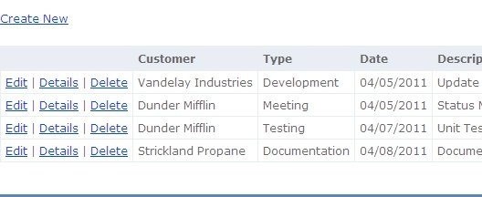

Create, read, update, and delete (CRUD) operations are easy to perform in ASP.NET MVC. By using the default T4 scaffolding templates and strongly-typed views you can quickly build a web application that can create, update, and delete records.

Using ASP.NET MVC 3 I built a simple Billing Application that performs CRUD operations on an XML file. With LINQ I was able to quickly write code to update nodes in the XML file.

## How my app works

My ASP.NET MVC 3 Billing App uses the [Repository pattern](https://msdn.microsoft.com/en-us/library/ff649690.aspx) for accessing data. The advantages with this pattern are it makes my methods easier to maintain and limits the amount of duplicated code in the data access layer. For each CRUD operation I have a method in my repository.

## Model

I created a _Billing.cs_ class based on the structure of my _Billings.xml_ file.

```xml
<?xml version="1.0" encoding="utf-8"?>
<billing>

    <item>
        <id>1</id>
        <customer>Vandelay Industries</customer>
        <type>Development</type>
        <date>4/5/2011</date>
        <description>Update jQuery animation on Intranet homepage</description>
        <hours>2</hours>
    </item>
    <item>
        <id>2</id>
        <customer>Dunder Mifflin</customer>...
```

In my _Billing.cs_ class I used the System.ComponentModel.DataAnnotations namespace for adding validation to my model properties.

```c#
public class Billing
{
    public Billing()
    {
        this.ID = 0;
        this.Customer = null;
        this.Type = null;
        this.Date = DateTime.Now;
        this.Description = null;
        this.Hours = 0;
    }

    public Billing(int id, string customer, string type, DateTime date, string description, int hours)
    {
        this.ID = id;
        this.Customer = customer;
        this.Type = type;
        this.Date = date;
        this.Description = description;
        this.Hours = hours;
    }

    public int ID { get; set; }
    [Required(ErrorMessage = "Customer is required")]
    public string Customer { get; set; }
    [Required(ErrorMessage = "Type is required")]
    public string Type { get; set; }
    [Required(ErrorMessage = "Date is required")]
    public DateTime Date { get; set; }
    [Required(ErrorMessage = "Description is required")]
    public string Description { get; set; }
    [Required(ErrorMessage = "Hours is required")]
    public int Hours { get; set; }
}
```

My model folder also contains my interface _IBillingRepository.cs_.

```c#
public interface IBillingRepository
{
    IEnumerable<Billing> GetBillings();
    Billing GetBillingByID(int id);
    void InsertBilling(Billing billing);
    void DeleteBilling(int id);
    void EditBilling(Billing billing);
}
```

And all the heavy lifting is done by my _BillingRepository.cs_ class.

```c#
public class BillingRepository: IBillingRepository
{
    private List<Billing> allBillings;
    private XDocument billingData;

    // constructor
    public BillingRepository()
    {
        allBillings = new List<Billing>();

        billingData = XDocument.Load(HttpContext.Current.Server.MapPath("~/App_Data/Billings.xml"));
        var billings = from billing in billingData.Descendants("item")
                        select new Billing((int)billing.Element("id"), billing.Element("customer").Value,
                        billing.Element("type").Value, (DateTime)billing.Element("date"),
                        billing.Element("description").Value, (int)billing.Element("hours"));
        allBillings.AddRange(billings.ToList<Billing>());
    }

    // return a list of all billings
    public IEnumerable<Billing> GetBillings()
    {
        return allBillings;
    }

    public Billing GetBillingByID(int id)
    {
        return allBillings.Find(item => item.ID == id);
    }

    // Insert Record
    public void InsertBilling(Billing billing)
    {
        billing.ID = (int)(from b in billingData.Descendants("item") orderby (int)b.Element("id") descending select (int)b.Element("id")).FirstOrDefault() + 1;

        billingData.Root.Add(new XElement("item", new XElement("id", billing.ID), new XElement("customer", billing.Customer),
            new XElement("type", billing.Type), new XElement("date", billing.Date.ToShortDateString()), new XElement("description", billing.Description),
            new XElement("hours", billing.Hours)));

        billingData.Save(HttpContext.Current.Server.MapPath("~/App_Data/Billings.xml"));
    }

    // Delete Record
    public void DeleteBilling(int id)
    {
        billingData.Root.Elements("item").Where(i => (int)i.Element("id") == id).Remove();

        billingData.Save(HttpContext.Current.Server.MapPath("~/App_Data/Billings.xml"));
    }

    // Edit Record
    public void EditBilling(Billing billing)
    {
        XElement node = billingData.Root.Elements("item").Where(i => (int)i.Element("id") == billing.ID).FirstOrDefault();

        node.SetElementValue("customer", billing.Customer);
        node.SetElementValue("type", billing.Type);
        node.SetElementValue("date", billing.Date.ToShortDateString());
        node.SetElementValue("description", billing.Description);
        node.SetElementValue("hours", billing.Hours);

        billingData.Save(HttpContext.Current.Server.MapPath("~/App_Data/Billings.xml"));
    }
}
```

## Controller

I have one Controller named _BillingController.cs_ which interacts with my repository and contains get and post requests for performing CRUD operations. By using the _ModelState.AddModelError()_ method I am able to display Exception error messages in red font for any failed CRUD operations.

```c#
public class BillingController : Controller
{
    private IBillingRepository _repository;
    private SelectList typeList = new SelectList(new[]{"Meeting","Requirements","Development","Testing","Documentation"});

    public BillingController(): this(new BillingRepository())
    {
    }

    public BillingController(IBillingRepository repository)
    {
        _repository = repository;
    }


    public ActionResult Index()
    {
        return View(_repository.GetBillings());
    }


    public ActionResult Details(int id)
    {
        Billing billing = _repository.GetBillingByID(id);
        if (billing == null)
            return RedirectToAction("Index");

        return View(billing);
    }


    public ActionResult Create()
    {
        ViewBag.TypeList = typeList;
        return View();
    }


    [HttpPost]
    public ActionResult Create(Billing billing)
    {
        if (ModelState.IsValid)
        {
            try
            {
                _repository.InsertBilling(billing);
                return RedirectToAction("Index");
            }
            catch(Exception ex)
            {
                //error msg for failed insert in XML file
                ModelState.AddModelError("", "Error creating record. " + ex.Message);
            }
        }

        return View(billing);
    }


    public ActionResult Edit(int id)
    {
        Billing billing = _repository.GetBillingByID(id);
        if (billing == null)
            return RedirectToAction("Index");

        ViewBag.TypeList = typeList;
        return View(billing);
    }


    [HttpPost]
    public ActionResult Edit(Billing billing)
    {
        if (ModelState.IsValid)
        {
            try
            {
                _repository.EditBilling(billing);
                return RedirectToAction("Index");
            }
            catch (Exception ex)
            {
                //error msg for failed edit in XML file
                ModelState.AddModelError("", "Error editing record. " + ex.Message);
            }
        }

        return View(billing);
    }


    public ActionResult Delete(int id)
    {
        Billing billing = _repository.GetBillingByID(id);
        if (billing == null)
            return RedirectToAction("Index");
        return View(billing);
    }


    [HttpPost]
    public ActionResult Delete(int id, FormCollection collection)
    {
        try
        {
            _repository.DeleteBilling(id);
            return RedirectToAction("Index");
        }
        catch(Exception ex)
        {
            //error msg for failed delete in XML file
            ViewBag.ErrorMsg = "Error deleting record. " + ex.Message;
            return View(_repository.GetBillingByID(id));
        }
    }
}
```

## View

My Views are standard since they use the default T4 scaffolding templates (Create, Delete, Details, Edit, and List). One thing I added to my Create and Edit Views was the jQuery UI date picker. With ASP.NET MVC the Scripts and Content folders come with the jQuery UI base theme installed by default. To utilize jQuery UI I added an optional _RenderSection_ to my layout master page in the head for adding the jQuery UI stylesheet to specific Views. All I had to do was add the jQuery UI stylesheet and JavaScript code to the Create and Edit Views to get the date picker up and running.

_\_Layout.cshtml_ optional RenderSection tag

```html
<html>
<head>
    <title>@ViewBag.Title</title>
    <link href="@Url.Content("~/Content/Site.css")" rel="stylesheet" type="text/css" />


    @RenderSection("Header", false)

    <script src="@Url.Content("~/Scripts/jquery-1.4.4.min.js")" type="text/javascript"></script>
</head>
</pre>
<em>Create.cshtml</em> JavaScript and CSS for Date Picker
<pre lang="html4strict">
@section Header{
    <link href="@Url.Content("~/Content/themes/base/jquery-ui.css")" rel="stylesheet" type="text/css" />
}

<h2>Create</h2>
<script src="@Url.Content("~/Scripts/jquery-ui.min.js")" type="text/javascript"></script>
<script src="@Url.Content("~/Scripts/jquery.validate.min.js")" type="text/javascript"></script>
<script src="@Url.Content("~/Scripts/jquery.validate.unobtrusive.min.js")" type="text/javascript"></script>

<script type="text/javascript">
    $(function () {
        $("#Date").datepicker();
    });
</script>
```

## Conclusion

ASP.NET MVC makes it easy to perform CRUD operations on data. The T4 Scaffolding templates create forms and lists for your strongly-typed Views so you don't have to waste time manually coding them yourself. These templates also provide form validation which speeds up the development process. ASP.NET MVC comes with some great tools to get your web apps up and running very quickly.
