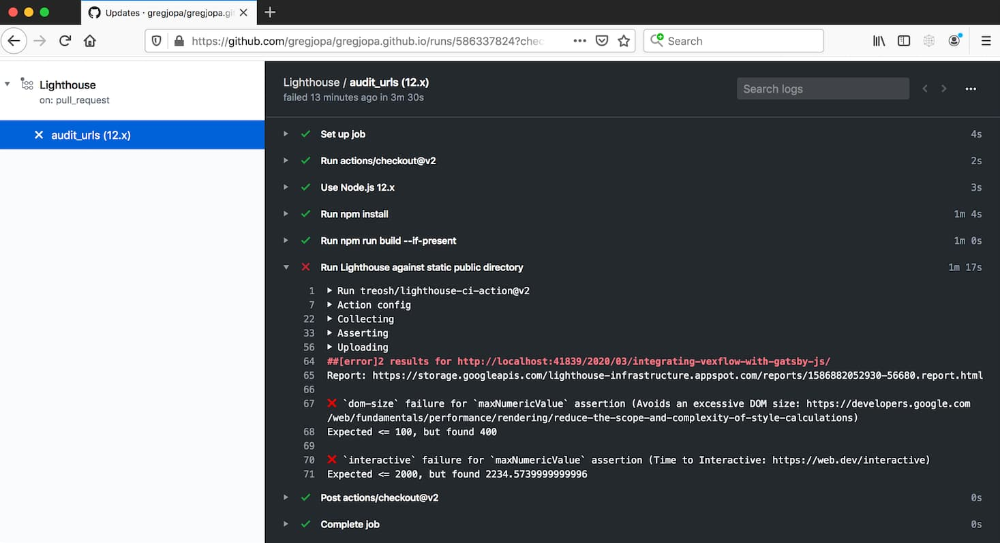

The project [Lighthouse CI Action](https://github.com/treosh/lighthouse-ci-action) makes it easy to run Lighthouse Audits with GitHub Actions.
The audit results can be used to enforce a performance budget for your website.
For example, here's what a job failure looks like when the DOM Size and Time To Interactive (TTI) metrics exceed the performance budget:



In this post I'll explain how I set up a performance budget for my personal blog which is built with [Gatsby.js](https://www.gatsbyjs.org/).

### GitHub Action Setup

The [examples in the Lighthouse CI Action docs](https://github.com/treosh/lighthouse-ci-action#example) are a great way to learn what configurations are possible.
I followed the static site recipe with a few tweaks.

Here's the job workflow I used for my Gatsby.js site:

1. Check out the source branch
2. Install npm dependencies
3. Build the static site
4. Run Lighthouse audits against the provided list of urls
5. Run assertions to ensure no thresholds are exceeded

There are two specific settings I want to highlight:

1. staticDistDir - Lighthouse CI supports running audits against static html files.
It can spin up a web server and host these static files and run audits against them.
To utilize this feature, I set up the job to run `npm run build` before the Lighthouse audit.
I also updated the lighthouserc.json file to look for the static site in the public directory `"staticDistDir": "./public"`.
2. Multiple Runs - Some performance metrics in Lighthouse audits can be flaky.
Thankfully there's an option to specify multiple runs and lighthouse-ci will magically take the averages.
For example, I'm running three audits for each url with the `runs: 3` option.

Here's my full configuration file:

```yml
name: Lighthouse
on:
  push:
    branches:
      - source
  pull_request:
    branches:
      - source
jobs:
  audit_urls:
    runs-on: ubuntu-latest
    strategy:
      matrix:
        node-version: [12.x]
    steps:
      - uses: actions/checkout@v2
      - name: Use Node.js ${{ matrix.node-version }}
        uses: actions/setup-node@v1
        with:
          node-version: ${{ matrix.node-version }}

      # build the static site
      - run: npm install
      - run: npm run build --if-present
      - name: Run Lighthouse against static public directory

      # configure lighthouse
        uses: treosh/lighthouse-ci-action@v2
        with:
          uploadArtifacts: true
          temporaryPublicStorage: true
          runs: 3
          configPath: '.github/workflows/lighthouserc.json'

```

### Lighthouse Configuration

There are two options for configuring a performance budget with Lighthouse:

1. budget.json - There's great work being done to standardize performance budgets across speed tools like Lighthouse and SpeedCurve.
Check out the [budget.json spec](https://github.com/GoogleChrome/budget.json) for more details.
2. assertions in lighthouserc.json - You can specify assertions directly in the lighthouserc.json file. These assertions are specific to Lighthouse. I chose this option because I wanted to have assertions for the different lighthouse categories.

Here's my lighthouserc.json file with assertions:

```json
{
  "ci": {
    "collect": {
      "url": [
        "http://localhost/",
        "http://localhost/2020/03/integrating-vexflow-with-gatsby-js"
      ],
      "staticDistDir": "./public"
    },
    "assert": {
      "assertions": {
        "categories:accessibility": ["error", { "minScore": 0.95 }],
        "categories:best-practices": ["error", { "minScore": 0.9 }],
        "categories:performance": ["error", { "minScore": 0.8 }],
        "categories:seo": ["warn", { "minScore": 1 }],
        "dom-size": ["error", {"maxNumericValue": 1000}],
        "first-contentful-paint": ["error", {"maxNumericValue": 2000}],
        "interactive": ["error", {"maxNumericValue": 5000}]
      }
    }
  }
}
```

The [Lighthouse CI Assertions documentation](https://github.com/GoogleChrome/lighthouse-ci/blob/master/docs/assertions.md)
goes into more detail about the features like asserting on specific audits and urls.
