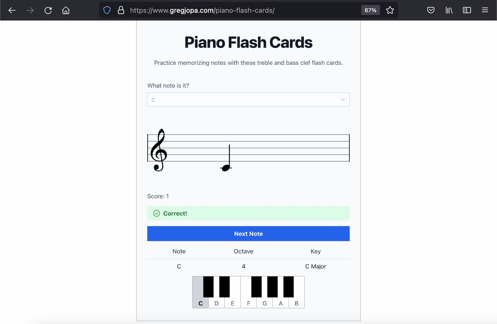
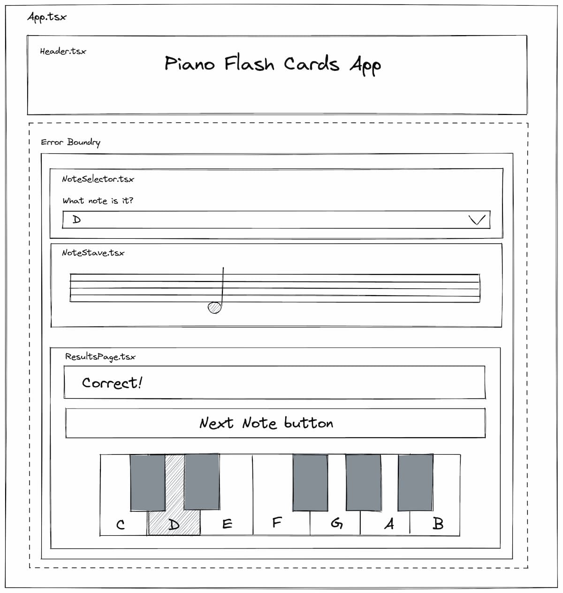

import DemoButtonGroup from "../../../src/components/DemoButtonGroup";



My wife and I recently got a piano and are learning how to play. I used this as an excuse to build another app with the [Vexflow music notation library](https://vexflow.com/).
In this post I'll share how I developed this flash card game to practice reading music notes and what I learned along the way.

<DemoButtonGroup
  downloadLink="https://github.com/gregjopa/piano-flash-cards"
  downloadText="Source code"
  demoLink="https://www.gregjopa.com/piano-flash-cards/"
  demoText="Play the game"
/>

### Game Design

Piano teachers frequently have students buy flash cards to practice reading music notes. This inspired me to build a flash card app and
make it more fun by adding a score concept with difficultly levels. Here are the concepts of the piano flash card game:

- Every time the user chooses the right note their score increases.
- If they choose the wrong note, they loose and start over.
- The user beats the game after they guess all the possible notes.
- The notes are displayed in random order.
- The user will advance through different levels to make the game harder as their score increases:
  - Beginner: treble clef only and in the key of C Major.
  - Intermediate: treble and bass clef with two basic key signatures (F Major and G Major).
  - Advanced: harder key signatures that have many flats or sharps.

### React App Design

A great place to start when building an app like this is the component architecture.

- How can this app be broken up into smaller components?
- Whats the single purpose of each component?

As you think about the answers to these questions it's helpful to sketch out the UI and highlight the individual components.
This will likely evolve as you develop your app. But it does help as a starting point. Here's a rough mockup I put together using
[Excalidraw](https://excalidraw.com/).



After identifying the UI components, it's helpful to think about the state you need to track with your application.
Usually, you want to leverage the URL path and/or query string for helping control state changes.
However, one thing I want to avoid is the user cheating by seeing the note to guess in the URL or skipping to the final difficulty level by changing the URL.
Based on this, I want to treat this single page app like a video game where there's no way for the user to skip ahead.

This app needs to manage the following data and store it in memory with `useState()`:

- available notes to guess for each difficulty level
- current note to guess
- user guess
- user score
- game state (not started, waiting for guess, incorrect, finished)

### Vexflow Integration

When building this flash cards app, I need the Vexflow library for two things:

1. To render the note. This includes rendering the stave, key signature, and the note.
2. To determine the right note names to display on the keyboard.

For the second use case, I found it tricky to determine the right note name for each key. For example, is the black key after middle C a C# or Db? I'm learning that this technically depends on the key signature and the context.
Luckily Vexflow includes a music theory library that can help determine the right note name. To keep it simple I decided to only use the notes from each key signature scale. Here's how you can use Vexflow to determine the note names for each key signature scale:

```js
import { KeyManager, Music } from "vexflow";

function getScaleNotesForKeySignature(keySignature) {
  const music = new Music();
  const keyManager = new KeyManager(keySignature);

  const { root, accidental = "", type } = music.getKeyParts(keySignature);
  const rootNoteIndex = music.getNoteValue(`${root}${accidental}`);
  const scale = music.getScaleTones(rootNoteIndex, Music.scaleTypes[type]);

  const scaleNotes = scale.map((tone) => {
    const canonicalNoteName = music.getCanonicalNoteName(tone);
    const keyManagerNote = keyManager.selectNote(canonicalNoteName);

    return [keyManagerNote.note, tone];
  });

  return scaleNotes;
}

getScaleNotesForKeySignature("Bm");
// => [["b", 11], ["c#", 1], ["d", 2], ["e", 4], ["f#", 6], ["g", 7], ["a", 9]]
```

#### Vexflow TypeScript Support

I used TypeScript for this app, and I was presently surprised by Vexflow's TypeScript support. It ships its own type declarations and many of the public interfaces include helpful descriptions.

#### Vexflow is ES6+

One thing that tripped me up is that Vexflow no longer supports ES5. The formatter module does not work when being transpiled to ES5. I used create-react-app for this project which transpiles to ES5 by default.
This caused my production builds to fail, and it took me a while to figure out why. After changing it to target ES6 it fixed the issue.
There's no need to support IE11 and other older browsers with this app so I used the following code to display a message to users on unsupported browsers.

```js
window.onload = function () {
  var doesNotSupportES6 = typeof Symbol === "undefined";
  if (doesNotSupportES6) {
    var headingElement = document.createElement("h1");
    headingElement.setAttribute("style", "text-align: center;");
    headingElement.textContent =
      "Failed to load the Piano Flash Card app. Your browser is too old!";
    document.querySelector("body").appendChild(headingElement);
  }
};
```

### Create React App

I really enjoyed building this app with [create-react-app](https://create-react-app.dev/). This app is client-side only so there was no need for a framework that supports server-side code. Here's why create-react-app is awesome:

- It supports TypeScript.
- It handles all the build script tooling.
- It uses [browserslist](https://browsersl.ist/) for determining which version of JavaScript to transpile to (ES6 for my use case).
- It provides [Jest](https://jestjs.io/) and [react-testing-library](https://testing-library.com/docs/react-testing-library/intro) to make it easy to write unit and integration tests.

### State Management Learnings

I recently watched this ["Goodbye, useEffect" Video](https://www.youtube.com/watch?v=bGzanfKVFeU) and decided to apply it to my app. Initially I focused on getting this flash card app working and I reached for useEffect to synchronize state across components.

At first, I had the Next Note button event handler update the GameState only and then had the useEffect hook react to it and finish up the rest of the state updates. Here's a simplified example,

**Before**

```js
// event handler for choosing the next note
function handleNextNote() {
  setGameState(GameState.GetNextNote)
}

useEffect(() => {
  if (gameState === GameState.GetNextNote) {
    setGuessedNoteName("");
    setActualNote(getNextRandomNote());
    setGameState(GameState.WaitingForGuess);
  }
}, [gameState]);
)
```

I learned from this talk that event handlers are a better place to manage side effects with state updates. I applied this learning and was able to get rid of useEffect altogether.

**After**

```js
function handleNextNote() {
  setGuessedNoteName("");
  setActualNote(getNextRandomNote());
  setGameState(GameState.WaitingForGuess);
}

// no need for useEffect() since all logic is handled in the event handler
```

The other fun refactor I did was reducing the amount of `useState()` calls I made by combining the related state data into a single nested object.

**Before**

```js
const [remainingBeginnerNotes, setRemainingBeginnerNotes] = useState(
  getBeginnerNotes()
);
const [remainingIntermediateNotes, setRemainingIntermediateNotes] = useState(
  getIntermediateNotes()
);
const [remainingAdvancedNotes, setRemainingAdvancedNotes] = useState(
  getAdvancedNotes()
);
```

**After**

```js
const [remainingNotes, setRemainingNotes] = useState({
  [DifficultyLevel.Beginner]: getBeginnerNotes(),
  [DifficultyLevel.Intermediate]: getIntermediateNotes(),
  [DifficultyLevel.Advanced]: getAdvancedNotes(),
});
```

### Tailwind

I used [Tailwind](https://tailwindcss.com/) for styles. Here are my favorite things about Tailwind:

- It makes it easy to build responsive apps. Design your mobile layout first and then add specific classes to control larger viewports (for example, increasing vertical padding on larger devices with: `sm:py-8 lg:py-10`)
- Focus and active states are easy to manage. For this app I wanted to make sure keyboard navigation is supported and it's very clear to the user which form element is active.
- There's a [prettier plugin for tailwind](https://tailwindcss.com/blog/automatic-class-sorting-with-prettier) so you don't have to worry about manually putting your classes in a specific order.

### Conclusion

It was a lot of fun building this piano flash cards app and it's helped me with learning piano and getting faster at reading sheet music.
React and Tailwind continue to be great tools for building rich UIs. Please give this app a try and let me know your feedback on GitHub!
