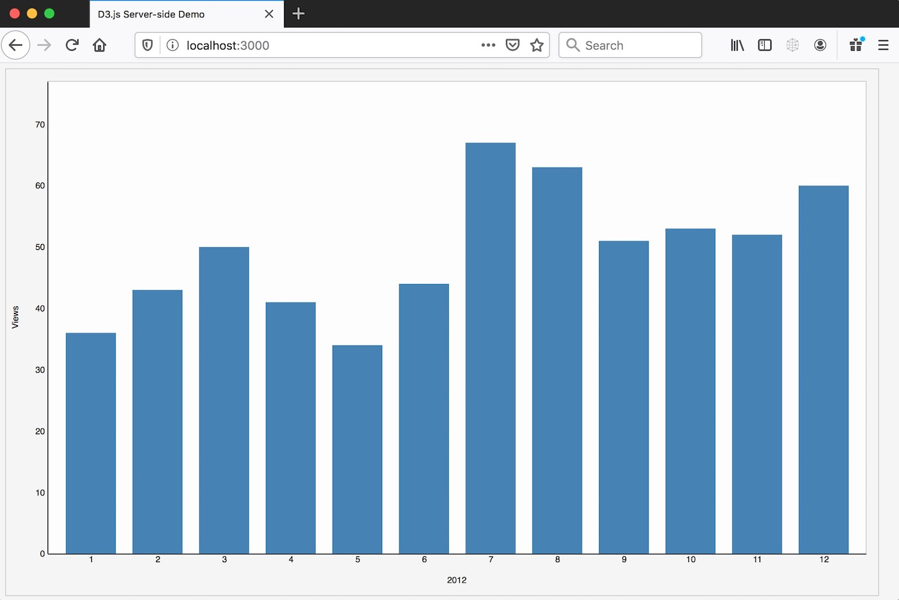

import DemoButtonGroup from "../../../src/components/DemoButtonGroup";



The [D3.js library](https://github.com/d3/d3) can be used on the client-side or the server-side.
This post will explain how to use JSDOM to render a D3 chart visualization on the server-side with Node.js.

<DemoButtonGroup
  downloadLink="https://github.com/gregjopa/d3-server-side-demo"
  downloadText="D3 Server-side Demo"
/>

### Setting up D3 on the Server-side

First install D3 with npm `npm install d3`. The [D3 library was re-written in version 4 to be modular](https://github.com/d3/d3/blob/master/CHANGES.md#changes-in-d3-40) so if you're using D3 version 4 or greater you have two options:

1. require the whole D3 library: `const d3 = require('d3');`
2. require just the modules you need. Ex:

```javascript
const d3 = Object.assign(
  {},
  require("d3-selection").require("d3-scale"),
  require("d3-axis"),
  require("d3-array")
);
```

The [d3-selection](https://github.com/d3/d3-selection) module depends on the DOM for operations like selecting elements and setting attributes.
Luckily we can use [JSDOM](https://github.com/jsdom/jsdom) to get d3-selection working in Node-land.

```javascript
const jsdom = require("jsdom");
const { JSDOM } = jsdom;
// create a new JSDOM instance for d3-selection to use
const document = new JSDOM().window.document;

d3.select(document.body).append("div");
// and so on
```

JSDOM is commonly used for unit testing modules that rely on the DOM. That way you can unit test client-side code without a browser.
The [d3-selection library uses JSDOM for unit testing](https://github.com/d3/d3-selection/tree/master/test/selection) so reference those tests for more examples.

### Demo App

The demo app I put together creates a helper for server-side rendering bar charts with D3. Here's an example of the helper in action:

```javascript
barChartHelper.getBarChart({
  data: fixtureData,
  width: 400,
  height: 300,
  xAxisLabel: "2012",
  yAxisLabel: "Views",
  containerId: "bar-chart-small",
});
```

At the time of this writing it's using D3 version 5 and Node.js version 12. Check out the source code on GitHub:
[https://github.com/gregjopa/d3-server-side-demo](https://github.com/gregjopa/d3-server-side-demo)
