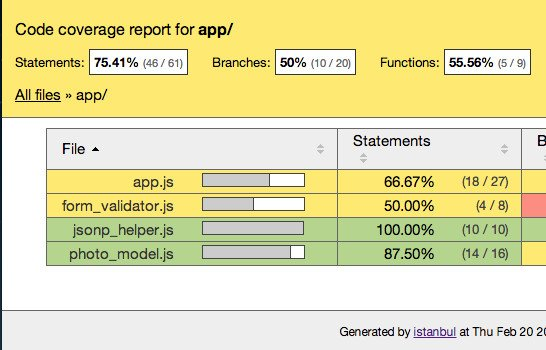
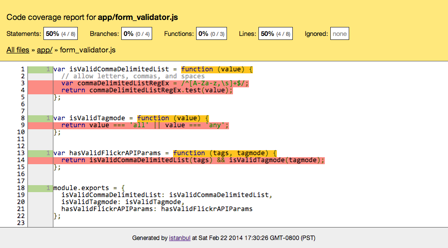
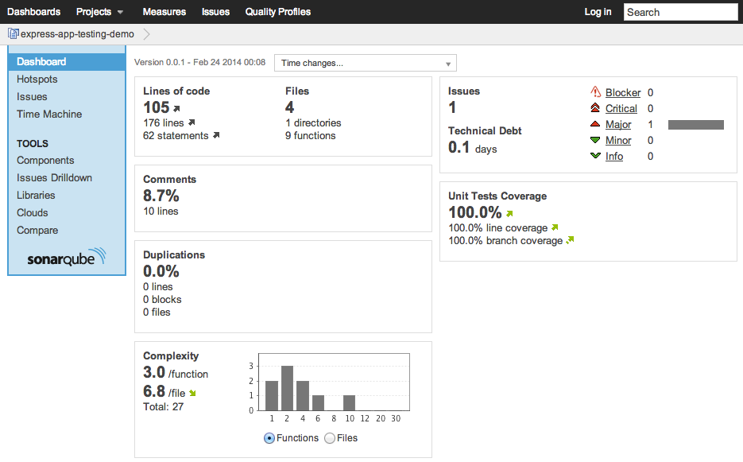

import DemoButtonGroup from "../../../src/components/DemoButtonGroup";



Developing maintainable apps requires having good test coverage. The JavaScript community has created some awesome tools that make it easy to implement workflows for code linting, unit/integration testing, and measuring code coverage. This post focuses on how to develop tests with [Mocha](http://mochajs.org/) and [Supertest](https://github.com/visionmedia/supertest) and how to generate code coverage reports with [Istanbul](https://gotwarlost.github.io/istanbul/).

<DemoButtonGroup
  downloadLink="https://github.com/gregjopa/express-app-testing-demo"
  demoLink="https://express-app-testing-demo.herokuapp.com/"
/>

## Demo App Functionality

I created a simple node.js app to demonstrate testing and code coverage. The source code for this app is on github here: [https://github.com/gregjopa/express-app-testing-demo](https://github.com/gregjopa/express-app-testing-demo). This app uses [Flickr's public feed api](https://www.flickr.com/services/feeds/docs/photos_public/) to search public photos. It has basic form functionality for entering search terms and based on that form input it retrieves photos. All logic in this app is handled on the server-side and no client-side JavaScript is used. This app is hosted on heroku here: [https://express-app-testing-demo.herokuapp.com/](https://express-app-testing-demo.herokuapp.com/).


This app uses the [express.js framework](https://expressjs.com/) along with [request](https://github.com/request/request) and [ejs](https://github.com/tj/ejs). [Grunt](https://gruntjs.com/) is used for implementing workflows for code linting, testing, and code coverage.

## Preparing a Test Plan

I recommend designing a test plan at the same time you design your application's functionality. Think about the different components of the app and how they can break. For example, if the app depends on an external api service assume that the api service can go offline or return invalid data. If the app accepts user input assume that the user input can be invalid and possibly dangerous. In my opinion the purpose of the test plan is to be an outline for developers as they write tests. The test plan should not be documentation for the tests since it can easily become out-of-date. Instead, your tests should be self-describing. For example, here is a simple test plan for this photo searching app:

1. Form input - if the user enters valid search terms the app should work.
2. Form input - if the user enters invalid search terms the app should return an error.
3. API data - if the data returned from the flickr api is valid the app should work.
4. API data - if the data returned from the flickr api is invalid the app should return an error.
5. API data - if the flickr api returns zero results an alert should be returned to notify the user.
6. Route - if the app is working correctly a 200 http status code should be returned.
7. Route - if there is a server error a 500 http status code should be returned.


## Tests

There are different types of tests that can be implemented when testing web applications:

* Unit tests - isolate a small block of code and test it's intention
* Integration tests - test how different components of an application work together
* Service tests - isolate a service to see if it's working correctly (ex: api endpoint, database)

My test app includes unit tests, integration tests, and api tests. I'm using the assertion library [should.js](https://github.com/tj/should.js) for clean and readable tests.

### Unit Tests

Form validation methods are a good example for unit testing. Typically form validation methods take in a single input parameter and use a regular expression to see the input value is valid or not.

Here's a form validation method with a couple Mocha unit tests:

``` javascript
var isValidCommaDelimitedList = function (value) {
  // allow letters, commas, and spaces
  var commaDelimitedListRegEx = /^[A-Za-z,\s]+$/;
  return commaDelimitedListRegEx.test(value);
};

// tests
describe('isValidCommaDelimitedList(value)', function () {

  it('should return true for valid list of search terms', function () {
    var tags = 'california, sunset, red';
    formValidator.isValidCommaDelimitedList(tags).should.be.true;
  });

  it('should return false for search term containing numbers', function () {
    var tags = 'dogs123';
    formValidator.isValidCommaDelimitedList(tags).should.be.false;
  });

});
```

### Integration Tests for Routes

Node web application routes can be tested using the [Supertest](https://github.com/visionmedia/supertest) library. Supertest can start up a node app, make http requests to routes, and run assertions on http responses. It can pass parameters to routes and run assertions on things like the response http status code, content type, and execute regular expressions against the response body.

If your routes depend on accessing a database or api I recommend mocking that data for your route tests. This way your database or api won't influence your route test results. I'm using the node module [nock](https://github.com/node-nock/nock) in my project to mock the data returned by the flickr public feed api.

Here are some route tests:

``` javascript
// route
app.get('/', function (req, res) {
  var tags = req.param('tags');
  var tagmode = req.param('tagmode');
  // more route logic here ...
});

// tests
describe('index route', function () {

  it('should respond with a 200 with invalid query parameters', function (done) {
    // invalid query parameters will return html containing an alert message
    request(app)
      .get('/?tags=california123&tagmode=all')
      .expect('Content-Type', /html/)
      .expect(200)
      .expect(/<div class="alert alert-danger">/, done);
  });

  it('should respond with a 500 error due to bad jsonp data', function (done) {

    // mock the flickr public feed api endpoint with invalid jsonp data that's missing parentheses
    var jsonpData = 'jsonFlickrFeed{"items": [' +
      '{ "title": "Boating",' +
        '"media": {"m":"http://farm4.staticflickr.com/3727/12608622365_9e9b8b377d_m.jpg"} },' +
      '{ "title": "Signs",' +
        '"media": {"m":"http://farm8.staticflickr.com/7446/12608714423_efaf73400c_m.jpg"} }' +
      ']}';

    var flickrFeedApi = nock('http://api.flickr.com')
      .get('/services/feeds/photos_public.gne?tags=california&tagmode=all&format=json')
      .reply(200, jsonpData);

    request(app)
      .get('/?tags=california&tagmode=all')
      .expect(500, done);

  });

});
```

### API Tests

It can be helpful to have tests for an external service used by your app. If you rely on external services and you have tests for them then when your app breaks it easier to determine if the problem is with your code base or the external service.

Mocha makes it easily to asynchronously test an api endpoint. Here's a test I have for flickr's public feed api:

``` javascript
// flickr public feed api
function API (params) {
  this.uri = 'http://api.flickr.com/services/feeds/photos_public.gne';
  this.qs = {
    tags: params.tags || '',
    tagmode: params.tagmode || '',
    format: params.format || 'json'
  };
}

// test
describe('flickr public feed api', function () {

  it('should return expected json format', function (done) {

    var apiTest = new API({
      tags: 'california',
      tagmode: 'all'
    });

    request.get(apiTest, function (error, response, body) {
      response.statusCode.should.equal(200, 'Invalid http status code');

      var json = jsonpHelper.parseJSONP(body);
      json.should.have.property('items');

      var photos = json.items;
      photos.should.be.an.instanceOf(Array);

      photos.forEach(function (photo) {
        photo.should.have.keys(
          'title',
          'link',
          'media',
          'date_taken',
          'description',
          'published',
          'author',
          'author_id',
          'tags'
        );
      });

      done();
    });

  });

});
```


## Code Coverage

Code coverage tools analyze an application's source code and test suite and then identify code that's missing tests. Code coverage provides a way to measure the quality of your application.

### Istanbul

[Istanbul](https://gotwarlost.github.io/istanbul/) is a JavaScript code coverage tool that provides instrumentation and reporting. It has an html reporting option and also an lcov reporting option that can be used with the code quality tool [SonarQube](https://www.sonarqube.org/).

Here's a screenshot of the Istanbul html reporter for a module with zero tests:



After adding tests for all methods in this module the html report will look like this:


Istanbul can be installed as a global node module and used from the command line. Or you can use Istanbul as a local module with Grunt which is the approach I took with my test app. I describe configuring Istanbul with Grunt in the following "Grunt Workflow" section.

### SonarQube

SonarQube is a code quality tool that provides code coverage reporting as well as many other features. It's possible to integrate a JavaScript project into Sonar by using Istanbul's instrumentation. Istanbul can output an lcov.info file that can be used by the sonar-runner. The [sonar-runner](https://docs.sonarqube.org/display/SONARQUBE51/Installing+and+Configuring+SonarQube+Runner) works by reading a config file at the root of your project, performing some analysis, and then uploading statistics to the SonarQube server. Here is a link to my test project's sonar config file: [https://github.com/gregjopa/express-app-testing-demo/blob/master/sonar-project.properties](https://github.com/gregjopa/express-app-testing-demo/blob/master/sonar-project.properties)

Sonar stores code coverage statistics about your application in a database which makes it possible to compare different versions of your application to see if your code coverage is getting better or worse.

Here's a screenshot of this test project in SonarQube:



## Grunt Workflow

Grunt can be used to configure Mocha and Istanbul so you don't need to worry about installing them as global modules. Here are the grunt plugins I'm using for Mocha and Instanbul:

* [grunt-mocha-test](https://github.com/pghalliday/grunt-mocha-test)
* [grunt-istanbul](https://github.com/taichi/grunt-istanbul)

The grunt-istanbul plugin is easy to use with Mocha or any other testing framework. To configure the grunt-istanbul plugin setup a task to run the following:

1. Instrument your source code
2. Run your test suite against your instrumented source code
3. Store your coverage results
4. Make the report

I follow these steps in my test project's Gruntfile here:
[https://github.com/gregjopa/express-app-testing-demo/blob/master/Gruntfile.js](https://github.com/gregjopa/express-app-testing-demo/blob/master/Gruntfile.js)

When I normally run my test suite I want it to point directly at my source code. But when I run the Istanbul code coverage task I want my test suite to point at the instrumented source code. To accomplish this I created a require_helper module. This require_helper module uses an environment variable to determine which path to use for loading the source code to run the tests against. When I execute my code coverage grunt task I set the environment variable using the [grunt-env](https://github.com/jsoverson/grunt-env) plugin to point to the instrumented source code. Here's some example code to demonstrate how this requireHelper module works:

``` javascript
// require_helper.js
module.exports = function (path) {
  return require((process.env.APP_DIR_FOR_CODE_COVERAGE || '../app/') + path);
};

// using requireHelper in a test
var requireHelper = require('../require_helper');
var formValidator = requireHelper('form_validator');
```


## Conclusion

Code coverage is easy to setup using Grunt and Istanbul. Having statistics like code coverage will make your application easier to maintain and update. But code coverage is not perfect so make sure to still manually review your source code to see if you have tests for every use case. For my next post I plan on writing about testing and code coverage for client-side JavaScript apps.
